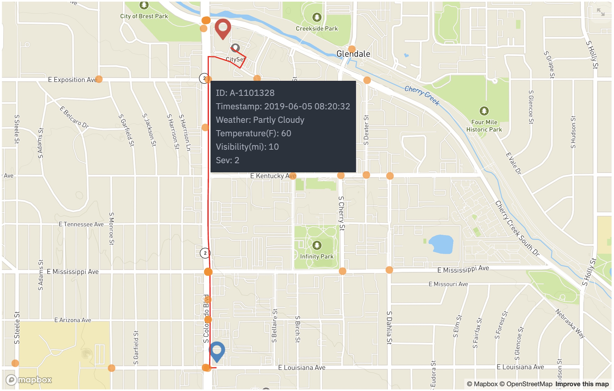

# routr
Proof-of-Concept for Route Risk Profiling on US Roads


## Quick Setup
1. Clone the repository to a local folder <br/>
```git clone git@github.com:ANALYTQ/routr.git```<br/><br/>
2. Change directory to routr and install dependencies <br/>
```cd routr``` <br/>
```pip install -r requirements.txt```<br/><br/>
3. Set LOCATION_KEY environment variable to contain the API_KEY needed to use Google's Geolocation and Geoencoding Service; grab it from the repo's secrets, or create your own api key (preferred) -- <a href="https://developers.google.com/maps/documentation/javascript/get-api-key">link</a> )<br/>
a. On Linux or Mac<br/>
&nbsp;&nbsp;&nbsp;&nbsp;```export LOCATION_KEY={Google Maps API Key}```<br/>
b. On Windows -- on Command Prompt or PowerShell<br/>
&nbsp;&nbsp;&nbsp;&nbsp;```setx LOCATION_KEY "{Google Maps API Key}"```<br/><br/>
4. Grab a copy of US Accidents dataset csv file by following the instructions <a href="https://smoosavi.org/datasets/us_accidents">here</a>. By default, the file will be enclosed in a tar.gz archive, which you can open using your Finder/Windows Explorer or zipping utility.<br/><br/>
5. Run the app<br/>
```streamlit run app.py```
